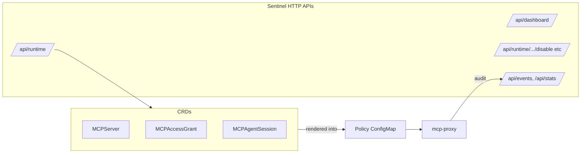
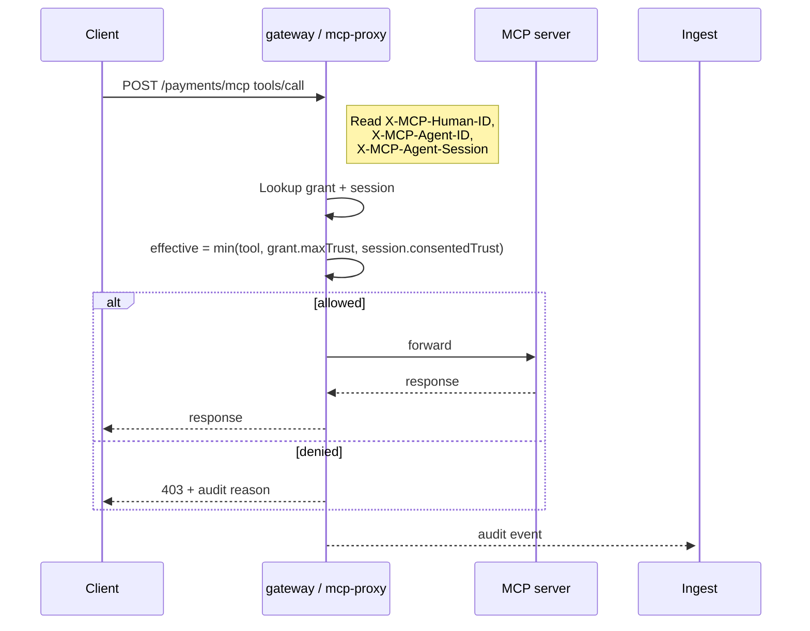

# API Reference

The MCP Runtime API surface comes in three layers:

1. **CRDs** under `mcpruntime.org/v1alpha1`: `MCPServer`, `MCPAccessGrant`, `MCPAgentSession`.
2. **Gateway headers** carried on live MCP requests when `gateway.enabled`.
3. **Sentinel HTTP APIs** exposed by `services/api`: dashboard, runtime governance, governance actions, analytics.



## Core resources

| Kind | Purpose |
|---|---|
| **MCPServer** | Runtime deployment spec plus gateway, auth, policy, session, tool inventory, rollout, and analytics settings. |
| **MCPAccessGrant** | Who can use which server, for which tools, with what admin-side maximum trust. |
| **MCPAgentSession** | Server-side consented trust, expiry, revocation, and upstream token references per agent session. |

## MCPServer surface

| Group | Fields |
|---|---|
| **Workload + routing** | `image`, `imageTag`, `registryOverride`, `replicas`, `port`, `servicePort`, `ingressPath`, `ingressHost`, `ingressClass`, `ingressAnnotations` |
| **Resources + env** | CPU/memory `requests`/`limits`, literal `env`, secret-backed `envFromSecret`, `imagePullSecrets` |
| **Identity + policy** | `tools[]`, `auth`, `policy`, `session`, `gateway` |
| **Delivery** | `analytics`, `rollout`, `useProvisionedRegistry` |
| **Advanced knobs** | `gateway.stripPrefix`, `session.upstreamTokenHeader`, `analytics.apiKeySecretRef`, `rollout.maxUnavailable`, `rollout.maxSurge` |

### Enums and semantics

| Enum | Values | Notes |
|---|---|---|
| **auth.mode** | `none`, `header`, `oauth` | Working path today is `header` (identity extraction at the gateway). |
| **policy.mode** | `allow-list`, `observe` | `allow-list` enforces deny-by-default; `observe` keeps the decision path visible. |
| **trust** | `low`, `medium`, `high` | Used on tools, grants, sessions. Effective trust = min(grant, session). |
| **rollout.strategy** | `RollingUpdate`, `Recreate`, `Canary` | Available on `spec.rollout`. |

### Validation rules in code

- `analytics.enabled` requires `gateway.enabled`.
- `gateway.port` must differ from `spec.port`.
- Canary rollouts require positive `canaryReplicas` strictly less than total replicas.

### Status

`MCPServer.status` exposes `phase`, `message`, `conditions[]`, and per-resource readiness booleans for `deployment`, `service`, `ingress`, `gateway`, `policy`. `MCPAccessGrant` and `MCPAgentSession` expose `phase`, `message`, and `conditions[]`.

### MCPServer example

```yaml
apiVersion: mcpruntime.org/v1alpha1
kind: MCPServer
metadata:
  name: payments
  namespace: mcp-servers
spec:
  image: registry.example.com/payments-mcp
  port: 8088
  ingressHost: mcp.example.com
  ingressPath: /payments/mcp
  gateway:
    enabled: true
  auth:
    mode: header
    humanIDHeader: X-MCP-Human-ID
    agentIDHeader: X-MCP-Agent-ID
    sessionIDHeader: X-MCP-Agent-Session
  policy:
    mode: allow-list
    defaultDecision: deny
    enforceOn: call_tool
    policyVersion: v1
  session:
    required: true
    store: kubernetes
    headerName: X-MCP-Agent-Session
    maxLifetime: 24h
    idleTimeout: 1h
  tools:
    - name: list_invoices
      requiredTrust: low
    - name: refund_invoice
      requiredTrust: high
  analytics:
    enabled: true
    ingestURL: http://mcp-sentinel-ingest.mcp-sentinel.svc.cluster.local:8081/events
  rollout:
    strategy: Canary
    canaryReplicas: 1
```

## Grants and sessions

`MCPAccessGrant.spec.disabled` and `MCPAgentSession.spec.revoked` are the hard kill switches — they turn off access without deleting the underlying object's history.

### MCPAccessGrant

```yaml
apiVersion: mcpruntime.org/v1alpha1
kind: MCPAccessGrant
metadata:
  name: payments-ops-agent
  namespace: mcp-servers
spec:
  serverRef:
    name: payments
  subject:
    humanID: user-123
    agentID: ops-agent
  maxTrust: high
  policyVersion: v1
  toolRules:
    - name: list_invoices
      decision: allow
      requiredTrust: low
    - name: refund_invoice
      decision: allow
      requiredTrust: high
```

### MCPAgentSession

```yaml
apiVersion: mcpruntime.org/v1alpha1
kind: MCPAgentSession
metadata:
  name: sess-8f1b9d
  namespace: mcp-servers
spec:
  serverRef:
    name: payments
  subject:
    humanID: user-123
    agentID: ops-agent
  consentedTrust: medium
  expiresAt: "2026-03-26T12:00:00Z"
  upstreamTokenSecretRef:
    name: payments-upstream-token
    key: access-token
```

## Security and auth

### Implemented today

- **Header-based identity** at the gateway (default path).
- **Optional bearer-token validation** against JWKS / issuer / audience on `mcp-sentinel` API + ingest services.
- `spec.auth.mode: oauth` exists on the type as a forward-looking shape.

### Not yet implemented

No `/authorize`, `/token`, `/.well-known/oauth-authorization-server`, PKCE, or Dynamic Client Registration endpoint in this release.

### Practical model

- Use the **gateway** for human, agent, and session identity headers.
- Use **MCPAccessGrant + MCPAgentSession** for trust and revocation.
- Use **OIDC-issued bearer tokens** only where Sentinel services validate them.

## Gateway flow and headers



- **Enforcement point:** authorization is evaluated at `call_tool` / `tools/call`, not at discovery time.
- **Allow-list first:** missing grants or missing tool rules deny by default unless the policy explicitly overrides the default decision.
- **Audit on allow and deny:** the gateway emits decision, reason, trust levels, human, agent, session, server, cluster, and namespace fields.

```text
X-MCP-Human-ID:    user-123
X-MCP-Agent-ID:    ops-agent
X-MCP-Agent-Session: sess-8f1b9d
```

## Dashboard API

Overview statistics for the dashboard cards.

```text
GET /api/dashboard/summary
```

Returns: `total_events`, `active_servers`, `active_grants`, `active_sessions`, `latest_source`, `last_event_type`, `last_event_time`.

## Runtime Governance API

Manage access grants, sessions, and view runtime state. All `/api/runtime/*` routes require an `x-api-key` header; requests without it receive `401`. `POST` requests create or update the Kubernetes CRs that the operator renders into the gateway policy ConfigMap.

For `POST /api/runtime/grants` and `POST /api/runtime/sessions`, the API resolves `serverRef` to an `MCPServer` in the cluster. If that server does not exist, the call returns `400` with a clear `unknown serverRef` message. The server lookup is **not** part of a single distributed transaction with the grant/session write — a concurrent delete can leave a stale reference (same as `kubectl apply`). Kubernetes apply errors are surfaced with the status the API server would use, when available.

```text
GET  /api/runtime/servers              # List MCP server deployments
GET  /api/runtime/grants               # List MCPAccessGrant resources
POST /api/runtime/grants               # Create or update an MCPAccessGrant (x-api-key)
GET  /api/runtime/sessions             # List MCPAgentSession resources
POST /api/runtime/sessions             # Create or update an MCPAgentSession (x-api-key)
GET  /api/runtime/components           # Sentinel component health status
GET  /api/runtime/policy?namespace=&server=   # Get rendered policy for a server
```

### Grant apply body

```json
{
  "name": "payments-ops-agent",
  "namespace": "mcp-servers",
  "serverRef": {"name": "payments", "namespace": "mcp-servers"},
  "subject": {"humanID": "user-123", "agentID": "ops-agent"},
  "maxTrust": "high",
  "policyVersion": "v1",
  "toolRules": [
    {"name": "read_invoice", "decision": "allow"},
    {"name": "refund_invoice", "decision": "allow", "requiredTrust": "high"}
  ]
}
```

### Session apply body

```json
{
  "name": "sess-8f1b9d",
  "namespace": "mcp-servers",
  "serverRef": {"name": "payments", "namespace": "mcp-servers"},
  "subject": {"humanID": "user-123", "agentID": "ops-agent"},
  "consentedTrust": "medium",
  "policyVersion": "v1",
  "expiresAt": "2030-12-31T23:59:00Z"
}
```

## Governance Actions API

Safe operational actions for grants, sessions, and components.

```text
POST /api/runtime/grants/{namespace}/{name}/disable
POST /api/runtime/grants/{namespace}/{name}/enable
POST /api/runtime/sessions/{namespace}/{name}/revoke
POST /api/runtime/sessions/{namespace}/{name}/unrevoke
POST /api/runtime/actions/restart     # Body: {component: "api"} or {all: true}
```

| Action | Effect |
|---|---|
| **Grant Toggle** | Enable / disable an `MCPAccessGrant` without deleting it. Disabled grants deny access at the gateway. |
| **Session Revoke** | Revoke / unrevoke an `MCPAgentSession`. Revoked sessions cannot be used for tool calls. |
| **Component Restart** | Rolling restart of Sentinel components (`api`, `ingest`, `processor`, `gateway`, `ui`) or all. |

## Analytics API

Read API over the ClickHouse-backed event stream.

```text
GET /api/events?limit=100
GET /api/stats
GET /api/sources
GET /api/event-types
GET /api/events/filter?server=payments&decision=deny&agent_id=ops-agent&limit=50
```

| Group | Fields |
|---|---|
| **Filter fields** | `source`, `event_type`, `server`, `namespace`, `cluster`, `human_id`, `agent_id`, `session_id`, `decision`, `tool_name` |
| **Audit payload fields** | `decision`, `reason`, `policy_version`, `required_trust`, `admin_trust`, `consented_trust`, `effective_trust` |
| **Transport fields** | `method`, `path`, `status`, `latency_ms`, `bytes_in`, `bytes_out`, `rpc_method` |

## Setup integration

`mcp-runtime setup` builds the runtime operator image, the gateway proxy image, the analytics service images, and deploys the bundled analytics stack by default. Use `--without-sentinel` to skip the request-path stack and keep only the runtime / operator footprint.

## Next

- [Sentinel](sentinel.md) — what each HTTP surface above maps to.
- [Architecture](architecture.md) — how requests flow through the gateway.
- [internals/api-types.md](internals/api-types.md) — file-level walkthrough of the CRD type sources.
