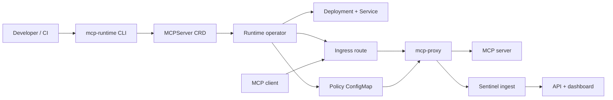
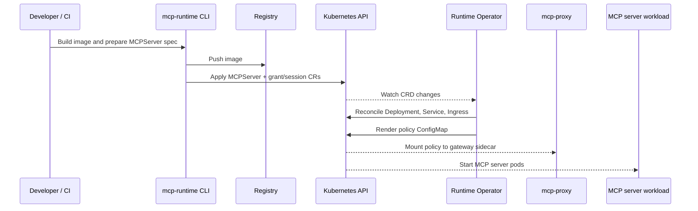
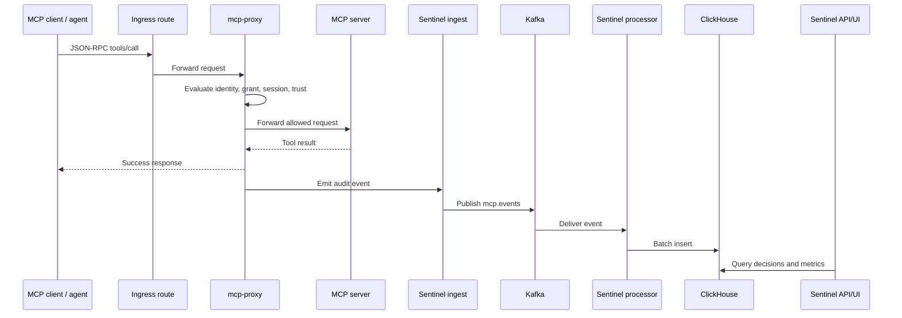
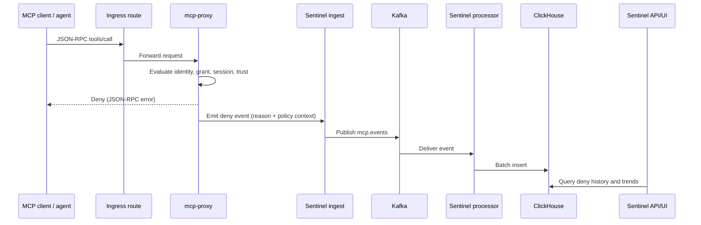
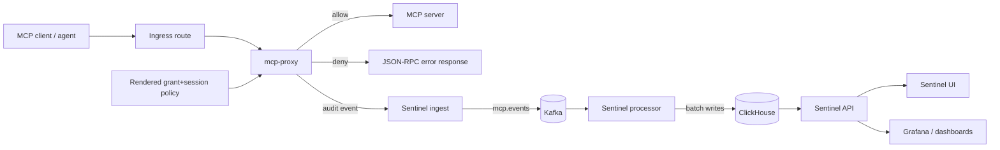

# Architecture

MCP Runtime is a Kubernetes-native control plane for MCP servers. It gives platform teams one operating surface for deploying servers, publishing images, brokering agent access, and keeping policy, consent, audit, and observability on the live request path across vendor-neutral Kubernetes environments.

## Platform Shape

| Piece | What it gives the company |
|---|---|
| Manager | Cluster install, declarative `MCPServer` resources, operator reconciliation, rollout status. |
| Registry | Controlled image publishing and pull-address resolution for deployed MCP servers. |
| Broker | A governed gateway that evaluates access before tool calls reach the server. |
| Sentinel | Audit, analytics, API, UI, and operational visibility for governed MCP traffic. |
| Infrastructure | Kubernetes-native routing, TLS/DNS integration, namespaces, services, and ingress ownership. |

## Market Position

MCP Runtime can be compared with MCP directories and catalogs, but it is not
trying to be a listing site or marketplace. Products such as Glama, Smithery,
Docker MCP Catalog, PulseMCP, mcp.so, and client-specific catalogs are strongest
at public discovery, metadata, installation snippets, or client onboarding. MCP
Runtime uses a platform control surface as the front door to a deployable
runtime platform.

| Market category | Typical scope | MCP Runtime difference |
|---|---|---|
| Public MCP directories | Search, categories, public server metadata, install snippets. | Adds a deployable Kubernetes control plane, registry workflow, broker, policy, audit path, and operational control surface. |
| Client catalogs | One-click install inside a specific MCP client. | Stays client-neutral and governs server access before tool calls reach the workload. |
| Hosted registry/control-plane products | Hosted discovery, connectors, gateway, or publisher workflows. | Can run in the company's cluster with CRDs, operator reconciliation, and private infrastructure ownership. |
| Container/catalog products | Trusted images, runtime packaging, and client connection profiles. | Extends beyond packaging into access grants, consented sessions, policy decisions, audit evidence, and compliance-oriented event history. |

The public `platform.mcpruntime.org` surface is therefore a preview of how the
platform looks after deployment. It is not a place for companies to list or sell
products; it is a way to evaluate the governed control-plane model before
installing it.

As of April 2026, we have not found another open-source MCP product that
combines a deployable Kubernetes runtime, registry workflow, brokered request
path, access/session model, audit pipeline, and operational control surface in
one system.

## Control Plane

The CLI owns workstation and cluster workflows: dependency checks, bootstrap preflights, setup, registry operations, manifest generation, and access-management commands. It writes Kubernetes resources rather than running the data path itself.

The operator watches `MCPServer`, `MCPAccessGrant`, and `MCPAgentSession` resources. For each server, it reconciles the workload Deployment, Service, Ingress, gateway sidecar configuration, policy materialization, and status conditions.

The CRDs are the contract between user intent and cluster state. The `api/v1alpha1` Go types and generated CRD YAML are the source of truth for supported fields and validation.

## End-to-End Flow

This is the full platform path from publish time to live governed tool calls.

### Provision and reconcile flow

### Live request flow (allow + audit)

### Live request flow (deny + audit)

## Brokered Request Path

Public traffic enters through the configured ingress controller. The default public shape is path based: `/<server-name>/mcp`, or `/<publicPathPrefix>/mcp` when `spec.publicPathPrefix` is set.

When the gateway is enabled, requests flow through `mcp-proxy` before they reach the MCP server. The proxy acts as the broker: it reads identity and session headers, evaluates grants and sessions from the rendered policy ConfigMap, forwards allowed MCP calls, rejects denied calls, and emits audit events.

Sentinel services receive those events, process them for analytics, and expose the dashboard/API used to inspect servers, grants, sessions, and recent decisions.

### Why this path matters

- Policy is enforced before tools execute, not after.
- Every allow/deny decision can be traced with subject, server, session, trust, and tool context.
- Security enforcement stays on the hot request path while analytics is decoupled through Kafka + ClickHouse.

### Sentinel request flow

1. The client sends MCP JSON-RPC traffic to the server ingress path.
2. `mcp-proxy` evaluates identity/session headers against operator-rendered policy.
3. Allowed calls are forwarded upstream; denied calls are rejected immediately.
4. `mcp-proxy` emits decision events to `ingest`, which publishes to Kafka.
5. `processor` consumes Kafka and writes normalized event records into ClickHouse.
6. `api`, `ui`, and dashboards query ClickHouse-backed data for governance and operations.

### Sentinel components involved

| Component | Responsibility in request flow |
|---|---|
| `mcp-proxy` | Inline policy enforcement, allow/deny decision, audit event emission. |
| `ingest` | Authenticates and accepts `/events`, then publishes to Kafka. |
| `kafka` | Buffers request events between ingest and processing. |
| `processor` | Consumes events, batches, and writes to ClickHouse. |
| `clickhouse` | Durable analytics and audit store for request decisions. |
| `api` | Query and governance surface used by CLI/UI and integrations. |
| `ui` / `grafana` | Human-facing operations and audit visibility. |

## Boundaries

| Layer | Responsibility |
|---|---|
| CLI | Local build/setup workflows, generated manifests, status, and access commands. |
| Operator | Kubernetes reconciliation for servers, routes, gateway config, policy, and status. |
| Registry | Image storage and pull-address resolution for deployed MCP servers. |
| Gateway | Per-request policy enforcement and audit emission. |
| Sentinel API/UI | Governance CRUD, dashboard state, analytics views, and operator-facing inspection. |
| Cluster infrastructure | Ingress controller, DNS, TLS, storage classes, and node image-pull behavior. |

## Operational Shape

`setup` installs the runtime namespaces, CRDs, registry, operator, ingress wiring, and the Sentinel stack unless explicitly disabled. In development, Kind and path-based localhost ingress are enough. In production, `MCP_PLATFORM_DOMAIN` can derive `registry.<domain>`, `mcp.<domain>`, and `platform.<domain>` so registry pulls, MCP traffic, and the dashboard each have stable hostnames.

The intended workflow is straightforward: platform teams install the stack, application teams publish MCP servers, security teams define grants and sessions, and agents call tools through the governed broker path.

For routing details and field semantics, see [Runtime](runtime.md) and [API reference](api.md).
