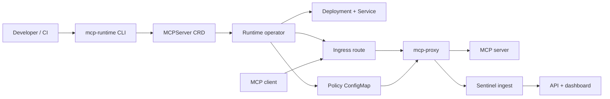

# Architecture

MCP Runtime is a Kubernetes-native control plane for deploying internal MCP servers and placing policy, consent, audit, and observability around their request path.

## Control Plane

The CLI owns workstation and cluster workflows: dependency checks, bootstrap preflights, setup, registry operations, manifest generation, and access-management commands. It writes Kubernetes resources rather than running the data path itself.

The operator watches `MCPServer`, `MCPAccessGrant`, and `MCPAgentSession` resources. For each server, it reconciles the workload Deployment, Service, Ingress, gateway sidecar configuration, policy materialization, and status conditions.

The CRDs are the contract between user intent and cluster state. The `api/v1alpha1` Go types and generated CRD YAML are the source of truth for supported fields and validation.

## Request Path

Public traffic enters through the configured ingress controller. The default public shape is path based: `/<server-name>/mcp`, or `/<publicPathPrefix>/mcp` when `spec.publicPathPrefix` is set.

When the gateway is enabled, requests flow through `mcp-proxy` before they reach the MCP server. The proxy reads identity and session headers, evaluates grants and sessions from the rendered policy ConfigMap, forwards allowed MCP calls, rejects denied calls, and emits audit events.

Sentinel services receive those events, process them for analytics, and expose the dashboard/API used to inspect servers, grants, sessions, and recent decisions.

## Boundaries

| Layer | Responsibility |
|---|---|
| CLI | Local build/setup workflows, generated manifests, status, and access commands. |
| Operator | Kubernetes reconciliation for servers, routes, gateway config, policy, and status. |
| Registry | Image storage and pull-address resolution for deployed MCP servers. |
| Gateway | Per-request policy enforcement and audit emission. |
| Sentinel API/UI | Governance CRUD, dashboard state, analytics views, and operator-facing inspection. |
| Cluster infrastructure | Ingress controller, DNS, TLS, storage classes, and node image-pull behavior. |

## Operational Shape

`setup` installs the runtime namespaces, CRDs, registry, operator, ingress wiring, and the Sentinel stack unless explicitly disabled. In development, Kind and path-based localhost ingress are enough. In production, `MCP_PLATFORM_DOMAIN` can derive `registry.<domain>`, `mcp.<domain>`, and `platform.<domain>` so registry pulls, MCP traffic, and the dashboard each have stable hostnames.

For routing details and field semantics, see [Runtime](runtime.md) and [API reference](api.md).
