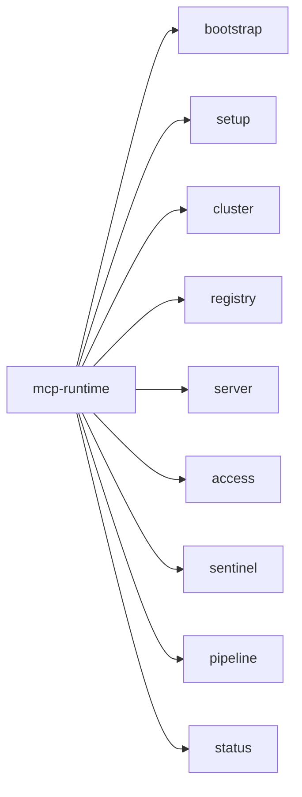

# CLI

The `mcp-runtime` CLI is the operator-facing front door. It bootstraps clusters, manages registries, applies `MCPServer` manifests, operates access grants and sessions, and inspects the runtime + sentinel stack.



## Fast path

```bash
make deps
make build

./bin/mcp-runtime setup
./bin/mcp-runtime status

./bin/mcp-runtime auth login --api-url https://platform.example.com --token-stdin < token.txt
./bin/mcp-runtime auth status

./bin/mcp-runtime registry push --image <image-ref-you-built-locally>
./bin/mcp-runtime pipeline generate --dir .mcp --output manifests/
./bin/mcp-runtime pipeline deploy --dir manifests/
```

For a new workstation, run `make deps-install` first where supported, then `STRICT_DEPS_CHECK=1 make deps-check`. Required host tools are Go `1.25+`, Make, Docker with a reachable daemon, `kubectl` configured for the cluster, plus `curl`, `jq`, and `python3` for documented dev flows. `kind` is required only for local Kind clusters.

Use the built-in help for the exact description, flags, and defaults of any command:

```bash
mcp-runtime --help
mcp-runtime <group> --help
mcp-runtime <group> <subcommand> --help
```

## Command map

| Group | What it covers | Important subcommands |
|---|---|---|
| `bootstrap` | Preflight checks for cluster prerequisites (DNS, default StorageClass, ingress class, MetalLB). With `--apply` on k3s only, install bundled CoreDNS + local-path manifests. | `bootstrap`, `--apply`, `--provider auto\|k3s\|rke2\|kubeadm\|generic` |
| `setup` | Install the platform stack, wire registry and ingress, deploy the operator, optionally include sentinel. | `setup`, `--with-tls`, `--without-sentinel` |
| `auth` | Save and inspect platform API credentials for non-kubeconfig platform flows. | `login`, `logout`, `status` |
| `cluster` | Initialize clusters, inspect health, configure kubeconfig and ingress, provision clusters, manage cert-manager. | `init`, `status`, `config`, `provision`, `cert status\|apply\|wait`, `doctor` |
| `registry` | Inspect the internal registry, configure an external one, push images. | `status`, `info`, `provision`, `push` |
| `server` | Manage `MCPServer` resources and operator-facing actions. | `list`, `get`, `create`, `apply`, `export`, `patch`, `delete`, `logs`, `status`, `policy inspect`, `build image` |
| `access` | Manage `MCPAccessGrant` and `MCPAgentSession` resources that feed the gateway policy layer. | `grant list/get/apply/delete/disable/enable`, `session list/get/apply/delete/revoke/unrevoke` |
| `sentinel` | Inspect and operate the bundled analytics, gateway, and observability stack. | `status`, `events`, `logs`, `port-forward`, `restart` |
| `pipeline` | Generate `MCPServer` manifests from metadata and deploy them. | `generate`, `deploy` |
| `status` | Aggregated platform health (cluster, registry, operator, servers, sentinel). | `status` |
| `completion` | Generate shell completion (bash, zsh, fish). | `completion bash\|zsh\|fish` |

The root command exposes `--debug` and `--version`. Subcommands inherit `--debug`; use `mcp-runtime --version` at the top level.

## bootstrap

Validate kubectl connectivity, CoreDNS, default `StorageClass`, Traefik `IngressClass`, and MetalLB. Missing pieces are warnings — the command surfaces them so you can decide what to install.

```bash
mcp-runtime bootstrap
mcp-runtime bootstrap --provider k3s
mcp-runtime bootstrap --apply --provider k3s   # Only k3s is automated
```

When to run it: on a fresh cluster before `setup`. Skip if your platform team already provides DNS, default storage, ingress, and load balancing.

## setup

The broad install path: runtime namespace, internal registry, operator, ingress wiring, bundled sentinel stack.

```bash
mcp-runtime setup
mcp-runtime setup --with-tls                   # cert-manager TLS for registry
mcp-runtime setup --without-sentinel           # skip request-path stack
mcp-runtime setup --test-mode                  # local Kind/dev build+push path
```

Flags: `--registry-type`, `--registry-storage`, `--ingress`, `--ingress-manifest`, `--force-ingress-install`, `--with-tls`, `--test-mode`, `--without-sentinel`, plus operator overrides `--operator-leader-elect`, `--operator-metrics-addr`, `--operator-probe-addr`.

`--test-mode` relaxes production guardrails, but it still builds and pushes the
operator, gateway proxy, and Sentinel images with `latest` tags to the
configured or bundled registry. With the bundled plain HTTP registry, cluster
nodes still need containerd/Docker trust for the exact image host they pull
from.

For local development where ingress traffic is exposed through port-forward or NodePort and the ingress controller does not publish load-balancer status, set `MCP_INGRESS_READINESS_MODE=permissive` before `setup`. The default is strict and waits for `Ingress.status.loadBalancer.ingress[]`.

## auth

Use `auth` for platform API credentials, not for Kubernetes cluster access.

Use cases:

- saving a platform API token locally for day-to-day platform flows
- recording a registry host alongside that token
- checking whether local platform credentials are already configured

Do not use `auth` for:

- `setup`
- cluster bootstrap
- cluster admin operations
- raw Kubernetes access

Examples:

```bash
# Save a token interactively
mcp-runtime auth login --api-url https://platform.example.com

# Save a token non-interactively
cat token.txt | mcp-runtime auth login \
  --api-url https://platform.example.com \
  --token-stdin

# Email/password login when the platform supports it
mcp-runtime auth login \
  --api-url https://platform.example.com \
  --email admin@example.com \
  --password '...'

# Record the platform registry host too
mcp-runtime auth login \
  --api-url https://platform.example.com \
  --token-stdin \
  --registry-host registry.example.com < token.txt

# Check current auth state
mcp-runtime auth status

# Remove saved local credentials
mcp-runtime auth logout
```

Notes:

- saved credentials are local to the workstation
- `MCP_PLATFORM_API_TOKEN` overrides any saved token when set
- `MCP_PLATFORM_API_URL` can provide the default API base URL
- kubeconfig-based cluster commands are separate from platform auth

## status

```bash
mcp-runtime status
mcp-runtime cluster status
mcp-runtime registry status
mcp-runtime sentinel status
```

## registry

```bash
# Inspect / configure
mcp-runtime registry status
mcp-runtime registry info
mcp-runtime registry provision --url registry.example.com
mcp-runtime registry provision \
  --url registry.example.com \
  --operator-image registry.example.com/mcp-runtime-operator:latest

# Push images (default mode is in-cluster helper pod)
mcp-runtime registry push --image <resolved-registry-host>/payments:v1
mcp-runtime registry push --image payments:v1 --mode direct
mcp-runtime registry push --image payments:v1 --name payments-api
```

When you use `server build image`, push the exact image ref it produced. That ref can include a resolved registry host instead of a short local name.

## pipeline

```bash
# Generate CRDs from metadata
mcp-runtime pipeline generate --dir .mcp --output manifests
mcp-runtime pipeline generate --file .mcp/payments.yaml --output manifests

# Deploy generated manifests
mcp-runtime pipeline deploy --dir manifests
mcp-runtime pipeline deploy --dir manifests --namespace mcp-servers
```

For the full build, push, deploy, and verify flow, see [Publish an MCP Server](publish-mcp-server.md).

## access

```bash
# Grants
mcp-runtime access grant list
mcp-runtime access grant get payments-admin --namespace mcp-servers
mcp-runtime access grant apply --file grant.yaml
mcp-runtime access grant disable payments-admin
mcp-runtime access grant enable payments-admin

# Sessions
mcp-runtime access session list
mcp-runtime access session get ops-agent --namespace mcp-servers
mcp-runtime access session apply --file session.yaml
mcp-runtime access session revoke ops-agent
mcp-runtime access session unrevoke ops-agent
```

`grant list` and `session list` default to `--all-namespaces`; pass `--namespace` to narrow scope.

## server

```bash
# Create / apply / export
mcp-runtime server create payments --image repo/payments --tag latest
mcp-runtime server create payments --file server.yaml
mcp-runtime server apply --file server.yaml
mcp-runtime server export payments --file payments.yaml

# Patch / inspect
mcp-runtime server patch payments --patch '{"spec":{"imageTag":"v2"}}'
mcp-runtime server status --namespace mcp-servers
mcp-runtime server policy inspect payments
mcp-runtime server logs payments --follow

# Build (push lives under registry)
mcp-runtime server build image payments --tag v1
mcp-runtime registry push --image <exact-image-ref-from-build>
```

`server patch` accepts inline `--patch` or `--patch-file` with `merge`, `json`, or `strategic` modes.

`server build image` updates matching `.mcp` metadata when you use the metadata-driven pipeline. It can resolve to a concrete host such as `10.43.109.51:5000/payments:v1`; push that exact ref. The command does not deploy by itself; push and deploy are separate steps.

## sentinel

```bash
# Health + recent activity
mcp-runtime sentinel status
mcp-runtime sentinel events
mcp-runtime sentinel restart gateway
mcp-runtime sentinel restart --all

# Logs (--follow / --previous / --tail / --since)
mcp-runtime sentinel logs ingest --since 15m --follow
mcp-runtime sentinel logs grafana --tail 500

# Port-forward (--port / --address)
mcp-runtime sentinel port-forward ui
mcp-runtime sentinel port-forward api --port 18080
```

**Component keys for `logs` and `restart`:** `clickhouse`, `zookeeper`, `kafka`, `ingest`, `api`, `processor`, `ui`, `gateway`, `prometheus`, `grafana`, `otel-collector`, `tempo`, `loki`, `promtail`.

**Port-forward shortcuts** are built in for: `api`, `ui`, `prometheus`, `grafana`.

## cluster

```bash
# Initialize / re-target
mcp-runtime cluster init
mcp-runtime cluster init --kubeconfig ~/.kube/config --context dev

# Configure ingress, kubeconfig, providers
mcp-runtime cluster config --ingress traefik
mcp-runtime cluster config --provider eks --name mcp-runtime --region us-west-1

# Provision
mcp-runtime cluster provision --provider kind --nodes 3
mcp-runtime cluster provision --provider eks --name prod-mcp

# cert-manager helpers
mcp-runtime cluster cert status
mcp-runtime cluster cert apply
mcp-runtime cluster cert wait --timeout 10m

# Doctor — registry / DNS / containerd preflight per-distro
mcp-runtime cluster doctor
```

**Provider status today:** `kind` and `eks` are active. `gke` and `aks` flags exist but their kubeconfig and provisioning helpers return planned/not-implemented paths in the current code.

## Common flows

```bash
# Local kind cluster
mcp-runtime cluster provision --provider kind --nodes 3
mcp-runtime setup

# Push a server image
mcp-runtime server build image payments
mcp-runtime registry push --image <exact-image-ref-from-build>

# Deploy from metadata
mcp-runtime pipeline generate --dir .mcp --output manifests
mcp-runtime pipeline deploy --dir manifests

# Apply access + inspect resulting policy
mcp-runtime access grant apply --file grant.yaml
mcp-runtime access session apply --file session.yaml
mcp-runtime server policy inspect payments

# Open the sentinel UI locally
mcp-runtime sentinel port-forward ui
mcp-runtime sentinel logs api --since 10m

# Patch a running server
mcp-runtime server patch payments --patch '{"spec":{"imageTag":"v2"}}'
mcp-runtime server status
mcp-runtime status
```

## Next

- [API](api.md) — exact resource fields the CLI is wrapping.
- [Publish an MCP Server](publish-mcp-server.md) — manifest, metadata, image push, deploy, and verification flow.
- [Sentinel](sentinel.md) — how `sentinel logs / events / restart` map to the bundled stack.
- [Cluster readiness](cluster-readiness.md) — distro-specific prerequisites.
