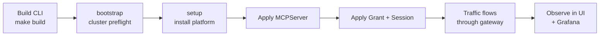

# Getting Started

The shortest path from an empty Kubernetes cluster to a governed MCP endpoint: install the control plane, registry, broker, and Sentinel stack; deploy one MCP server; grant access; and observe live traffic.

## Prerequisites

- Go `1.25+` (matches the repository `go.mod` files)
- `make`
- Docker or a Docker-compatible client, with the daemon running and reachable
- `kubectl` on `PATH`, configured for the target cluster
- `curl`, `jq`, and `python3` for documented dev and traffic-generation flows
- A Kubernetes cluster (k3s, kind, minikube, Docker Desktop Kubernetes, EKS — see [cluster-readiness.md](cluster-readiness.md) for distribution-specific prep)

Host bootstrap:

```bash
make deps-install              # best-effort install for supported macOS/Linux hosts
STRICT_DEPS_CHECK=1 make deps-check
```

`make deps-install` is intentionally best-effort: it can install some packages with Homebrew or apt, but it cannot enable Docker Desktop, create cloud credentials, or configure your kubeconfig. Re-run `STRICT_DEPS_CHECK=1 make deps-check` until the required host tools pass.

## 1. Build the CLI

```bash
make deps
make build
```

This produces `./bin/mcp-runtime`.

## 2. Preflight (optional but recommended)

```bash
./bin/mcp-runtime bootstrap
```

Validates: kubectl connectivity, CoreDNS, default `StorageClass`, Traefik `IngressClass`, MetalLB namespace. Warnings only — fix gaps with your platform tooling, or `bootstrap --apply --provider k3s` to install bundled CoreDNS / local-path on k3s.

## 3. Install the platform stack

```bash
./bin/mcp-runtime setup
```

`setup` installs the platform pieces companies need for MCP operations: CRDs, `mcp-runtime` and `mcp-servers` namespaces, the internal Docker registry, ingress wiring, the operator, and the bundled Sentinel stack for gateway policy, analytics, audit, and observability.

Common variants:

```bash
./bin/mcp-runtime setup --with-tls            # cert-manager TLS for the registry
./bin/mcp-runtime setup --without-sentinel    # skip the request-path stack
./bin/mcp-runtime setup --test-mode           # use kind-loaded operator image
```

## 4. Confirm health

```bash
./bin/mcp-runtime status
./bin/mcp-runtime cluster status
./bin/mcp-runtime registry status
./bin/mcp-runtime sentinel status
```

## 5. Connect your first MCP server

### Option A — direct manifest

```yaml
# payments.yaml
apiVersion: mcpruntime.org/v1alpha1
kind: MCPServer
metadata:
  name: payments
  namespace: mcp-servers
spec:
  image: registry.example.com/payments-mcp
  imageTag: v1.0.0
  port: 8088
  publicPathPrefix: payments
  gateway:
    enabled: true
  analytics:
    enabled: true
```

```bash
./bin/mcp-runtime server apply --file payments.yaml
./bin/mcp-runtime server status
```

#### How to write the manifest

Start with the smallest useful `MCPServer` and add features only when you need them.

- `metadata.name` becomes the server identity inside the platform.
- `metadata.namespace` is usually `mcp-servers`.
- `spec.image` points at the container image the platform should run.
- `spec.imageTag` sets the tag when you do not include one directly in `spec.image`.
- `spec.port` is the port your MCP server process listens on inside the container.
- `spec.publicPathPrefix` controls the public route prefix. `payments` becomes `/payments/mcp`.
- `spec.gateway.enabled` turns on brokered access and policy enforcement.
- `spec.analytics.enabled` turns on audit and analytics emission for governed traffic.

Use this minimal pattern for most first deployments:

```yaml
apiVersion: mcpruntime.org/v1alpha1
kind: MCPServer
metadata:
  name: my-server
  namespace: mcp-servers
spec:
  image: registry.example.com/my-server
  imageTag: v1.0.0
  port: 8088
  publicPathPrefix: my-server
  gateway:
    enabled: true
  analytics:
    enabled: true
```

Common edits:

- Set `spec.ingressHost` if you use host-based routing instead of the default path-based shape.
- Set `spec.servicePort` if you need a Service port other than `80`.
- Add `spec.envVars` or `spec.secretEnvVars` when the server needs configuration or credentials.
- Add `spec.imagePullSecrets` if the image registry requires explicit pull auth.
- Add `spec.tools`, `spec.auth`, `spec.policy`, `spec.session`, or `spec.rollout` when you are ready to describe stricter governance or delivery behavior.

For the full field surface, use the [API reference](api.md).

### Option B — metadata-driven pipeline

Author lightweight metadata YAML, generate CRDs, and deploy:

```bash
./bin/mcp-runtime server build image my-server --tag v1.0.0
./bin/mcp-runtime registry push --image my-server:v1.0.0
./bin/mcp-runtime pipeline generate --dir .mcp --output manifests/
./bin/mcp-runtime pipeline deploy --dir manifests/
```

The server lands at `/{server-name}/mcp` on the configured ingress host, behind the same platform surface you use for future MCP servers.

#### Publish to the platform: what to do, and what happens next

There are two ways to get a server into the platform:

1. Build and push an image, then apply an `MCPServer` manifest directly.
2. Build and push an image, then generate and deploy `MCPServer` manifests from `.mcp` metadata.

The end-to-end flow is the same either way:

1. Build the image for your server.
2. Push that image to the platform registry or another registry the cluster can pull from.
3. Apply an `MCPServer` resource that points at the image.
4. Let the operator reconcile the runtime objects for that server.

After the manifest is applied, the platform does the following:

1. Validates and stores the `MCPServer` resource in Kubernetes.
2. Resolves the final image reference using `spec.image`, `spec.imageTag`, and any registry override behavior.
3. Creates or updates a `Deployment` for the MCP server.
4. Creates or updates a `Service` for in-cluster traffic.
5. Creates or updates an `Ingress` so the server is reachable at `/{publicPathPrefix}/mcp` or the configured ingress path.
6. If `gateway.enabled` is set, wires traffic through the broker path and renders policy from matching grants and sessions.
7. If analytics are enabled, emits audit and traffic events into the Sentinel stack.
8. Reports readiness and status through `MCPServer.status`, `mcp-runtime server status`, and the platform UI.

Useful checks after publish:

```bash
./bin/mcp-runtime server status
./bin/mcp-runtime server get payments
./bin/mcp-runtime server policy inspect payments
./bin/mcp-runtime status
```

If the server does not come up, stay in the CLI first:

```bash
./bin/mcp-runtime server get payments
./bin/mcp-runtime server logs payments --follow
./bin/mcp-runtime sentinel logs gateway --follow
./bin/mcp-runtime status
```

## 6. Grant governed access (for gateway-enabled servers)

```yaml
# grant.yaml
apiVersion: mcpruntime.org/v1alpha1
kind: MCPAccessGrant
metadata:
  name: payments-ops-agent
  namespace: mcp-servers
spec:
  serverRef:
    name: payments
  subject:
    humanID: user-123
    agentID: ops-agent
  maxTrust: high
  toolRules:
    - name: list_invoices
      decision: allow
      requiredTrust: low
    - name: refund_invoice
      decision: allow
      requiredTrust: high
```

```yaml
# session.yaml (MCPAgentSession)
apiVersion: mcpruntime.org/v1alpha1
kind: MCPAgentSession
metadata:
  name: payments-ops-agent-session
  namespace: mcp-servers
spec:
  serverRef:
    name: payments
  subject:
    humanID: user-123
    agentID: ops-agent
  consentedTrust: high
  policyVersion: v1
```

```bash
./bin/mcp-runtime access grant apply --file grant.yaml
./bin/mcp-runtime access session apply --file session.yaml
./bin/mcp-runtime server policy inspect payments
```

## 7. Observe live traffic and policy

```bash
./bin/mcp-runtime sentinel port-forward ui          # Governance + dashboard
./bin/mcp-runtime sentinel port-forward grafana     # Metrics + traces + logs
./bin/mcp-runtime sentinel logs gateway --follow    # Tail the proxy
```

## End-to-end flow



## Next steps

- [Publish an MCP Server](publish-mcp-server.md) — write manifests or `.mcp` metadata, build, push, deploy, and verify.
- [Architecture](architecture.md) — how the pieces fit together.
- [CLI](cli.md) — full command reference.
- [API](api.md) — every CRD field and HTTP endpoint.
- [Sentinel](sentinel.md) — request-path governance, audit, observability.
