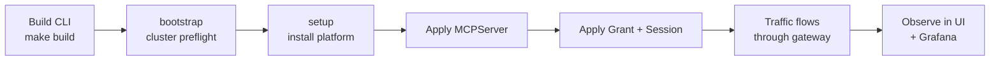

# Getting Started

The shortest path from an empty Kubernetes cluster to a governed MCP endpoint: install the control plane, registry, broker, and Sentinel stack; deploy one MCP server; grant access; and observe live traffic.

## Prerequisites

- Go `1.25+` (matches the repository `go.mod` files)
- `make`
- Docker or a Docker-compatible client, with the daemon running and reachable
- `kubectl` on `PATH`, configured for the target cluster
- `curl`, `jq`, and `python3` for documented dev and traffic-generation flows
- A Kubernetes cluster (k3s, kind, minikube, Docker Desktop Kubernetes, EKS — see [cluster-readiness.md](cluster-readiness.md) for distribution-specific prep)

Host bootstrap:

```bash
make deps-install              # best-effort install for supported macOS/Linux hosts
STRICT_DEPS_CHECK=1 make deps-check
```

`make deps-install` is intentionally best-effort: it can install some packages with Homebrew or apt, but it cannot enable Docker Desktop, create cloud credentials, or configure your kubeconfig. Re-run `STRICT_DEPS_CHECK=1 make deps-check` until the required host tools pass.

## 1. Build the CLI

```bash
make deps
make build
```

This produces `./bin/mcp-runtime`.

## 2. Confirm cluster readiness

```bash
./bin/mcp-runtime bootstrap
```

Before setup, confirm the target Kubernetes cluster is ready for registry
pushes, image pulls, ingress, storage, and TLS. See
[cluster-readiness.md](cluster-readiness.md) for distribution-specific
preparation.

`setup` installs MCP Runtime resources into an already-running cluster. It does
not configure node DNS, containerd or Docker registry trust, public DNS, TLS
issuers, image pull credentials, or storage classes. Fix those prerequisites
with your platform tooling before continuing.

`bootstrap` validates kubectl connectivity, CoreDNS, the default
`StorageClass`, Traefik `IngressClass`, and MetalLB namespace. Warnings only —
fix gaps with your platform tooling, or `bootstrap --apply --provider k3s` to
install bundled CoreDNS / local-path on k3s. After setup, run `cluster doctor`
to validate the installed MCP Runtime resources, registry pulls, ingress,
Sentinel, and operator readiness.

## 3. Contributor test-mode cluster

For local contributor work, use a disposable Kind cluster and `setup
--test-mode`. This path is for development and CI-style validation: it uses the
HTTP ingress overlay, avoids public DNS/TLS, and assumes local Docker can build
the runtime images. It does not skip builds: setup builds and pushes the
operator, gateway proxy, and Sentinel images with `latest` tags to the
configured or bundled registry.

Create Kind with the registry mirror MCP Runtime expects for image pulls:

```bash
cat > /tmp/mcp-runtime-kind.yaml <<'EOF'
kind: Cluster
apiVersion: kind.x-k8s.io/v1alpha4
containerdConfigPatches:
  - |-
    [plugins."io.containerd.grpc.v1.cri".registry.mirrors."registry.registry.svc.cluster.local:5000"]
      endpoint = ["http://127.0.0.1:32000"]
EOF

kind create cluster --name mcp-runtime --config /tmp/mcp-runtime-kind.yaml
kubectl config use-context kind-mcp-runtime
```

Build the CLI, run bootstrap, and install the stack in test mode:

```bash
make deps
make build

./bin/mcp-runtime bootstrap

MCP_SETUP_WAIT_TIMEOUT=900 \
  ./bin/mcp-runtime setup --test-mode \
  --ingress-manifest config/ingress/overlays/http
```

Confirm the install and expose the local dashboard/gateway:

```bash
./bin/mcp-runtime status
./bin/mcp-runtime cluster status
./bin/mcp-runtime registry status
./bin/mcp-runtime sentinel status
./bin/mcp-runtime cluster doctor

kubectl port-forward -n traefik svc/traefik 18080:8000
```

`cluster doctor` is most useful after setup because it validates the installed
MCP Runtime components, registry pulls, ingress, Sentinel, and operator
readiness. On a fresh cluster before setup, those resources do not exist yet.

Local URLs:

- Dashboard UI: `http://localhost:18080/`
- API: `http://localhost:18080/api`
- Demo MCP routes, after applying demo servers: `http://localhost:18080/<server-name>/mcp`

If pods report `ImagePullBackOff`, run `./bin/mcp-runtime cluster doctor`.
For Kind test mode, the usual cause is a cluster created without the
`registry.registry.svc.cluster.local:5000` mirror to `127.0.0.1:32000`. If pod
events include `http: server gave HTTP response to HTTPS client`, the node's
containerd tried HTTPS against the HTTP dev registry. Configure the insecure
registry mirror for the exact image host in the pod image reference, or use TLS.
On k3s with the bundled plain HTTP registry, that exact host may be the registry
Service `ClusterIP:port` such as `10.43.x.x:5000`; add a matching
`/etc/rancher/k3s/registries.yaml` mirror and restart k3s. On hosts where
`~/.kube/config` is empty or minimal, run setup with
`--kubeconfig /etc/rancher/k3s/k3s.yaml`.

If setup reached image deployment before the k3s mirror was configured, copy
the registry `Internal URL` from setup output into `registries.yaml`, restart
k3s/containerd, then rerun setup. The rerun republishes the `latest` images;
clear partial runtime namespaces first if StatefulSet storage was interrupted
during the failed run.

### Test the dashboard, image push, MCP request, and Sentinel

With the port-forward still running, open `http://localhost:18080/` to confirm
the platform dashboard loads. Then deploy the bundled Go MCP example through the
same build, push, generate, and deploy path contributors use for server work.

Create a local metadata file that enables gateway policy and Sentinel analytics:

```bash
cat > /tmp/go-example-mcp.yaml <<'EOF'
version: v1
servers:
  - name: go-example-mcp
    route: /go-example-mcp/mcp
    publicPathPrefix: go-example-mcp
    port: 8088
    namespace: mcp-servers
    envVars:
      - name: MCP_PATH
        value: /go-example-mcp/mcp
    tools:
      - name: add
        requiredTrust: low
      - name: upper
        requiredTrust: medium
    auth:
      mode: header
      humanIDHeader: X-MCP-Human-ID
      agentIDHeader: X-MCP-Agent-ID
      sessionIDHeader: X-MCP-Agent-Session
    policy:
      mode: allow-list
      defaultDecision: deny
      policyVersion: v1
    session:
      required: true
    gateway:
      enabled: true
    analytics:
      enabled: true
      ingestURL: http://mcp-sentinel-ingest.mcp-sentinel.svc.cluster.local:8081/events
      apiKeySecretRef:
        name: go-example-mcp-analytics
        key: api-key
EOF
```

Create the analytics secret in the server namespace:

```bash
API_KEY="$(
  kubectl get secret mcp-sentinel-secrets -n mcp-sentinel \
    -o jsonpath='{.data.API_KEYS}' | base64 -d | cut -d, -f1
)"

kubectl create secret generic go-example-mcp-analytics \
  -n mcp-servers \
  --from-literal=api-key="$API_KEY" \
  --dry-run=client -o yaml | kubectl apply -f -
```

Build and push the image into the Kind-accessible registry:

```bash
./bin/mcp-runtime server build image go-example-mcp \
  --metadata-file /tmp/go-example-mcp.yaml \
  --dockerfile examples/go-mcp-server/Dockerfile \
  --context examples/go-mcp-server \
  --registry registry.registry.svc.cluster.local:5000 \
  --tag dev

./bin/mcp-runtime registry push \
  --image registry.registry.svc.cluster.local:5000/go-example-mcp:dev
```

Generate and deploy the Kubernetes manifests:

```bash
rm -rf /tmp/go-example-mcp-manifests
./bin/mcp-runtime pipeline generate \
  --file /tmp/go-example-mcp.yaml \
  --output /tmp/go-example-mcp-manifests

./bin/mcp-runtime pipeline deploy --dir /tmp/go-example-mcp-manifests
kubectl rollout status deploy/go-example-mcp -n mcp-servers --timeout=180s
./bin/mcp-runtime server status --namespace mcp-servers
```

Apply an access grant and session for the local request:

```bash
cat > /tmp/go-example-access.yaml <<'EOF'
apiVersion: mcpruntime.org/v1alpha1
kind: MCPAccessGrant
metadata:
  name: go-example-local
  namespace: mcp-servers
spec:
  serverRef:
    name: go-example-mcp
  subject:
    humanID: local-user
    agentID: local-agent
  maxTrust: high
  policyVersion: v1
  toolRules:
    - name: add
      decision: allow
    - name: upper
      decision: allow
---
apiVersion: mcpruntime.org/v1alpha1
kind: MCPAgentSession
metadata:
  name: local-session
  namespace: mcp-servers
spec:
  serverRef:
    name: go-example-mcp
  subject:
    humanID: local-user
    agentID: local-agent
  consentedTrust: high
  policyVersion: v1
EOF

kubectl apply -f /tmp/go-example-access.yaml

until ./bin/mcp-runtime server policy inspect go-example-mcp --namespace mcp-servers | grep -q local-session; do
  sleep 2
done
```

Make a local MCP JSON-RPC request through Traefik and the Sentinel gateway:

```bash
BASE=http://localhost:18080/go-example-mcp/mcp
PROTO=2025-06-18

SESSION="$(
  curl -si \
    -H "content-type: application/json" \
    -H "accept: application/json, text/event-stream" \
    -H "Mcp-Protocol-Version: $PROTO" \
    -H "X-MCP-Human-ID: local-user" \
    -H "X-MCP-Agent-ID: local-agent" \
    -H "X-MCP-Agent-Session: local-session" \
    -d '{"jsonrpc":"2.0","id":1,"method":"initialize","params":{}}' \
    "$BASE" | awk -F': ' 'tolower($1)=="mcp-session-id"{print $2}' | tr -d '\r'
)"

curl -sS \
  -H "content-type: application/json" \
  -H "accept: application/json, text/event-stream" \
  -H "Mcp-Protocol-Version: $PROTO" \
  -H "Mcp-Session-Id: $SESSION" \
  -H "X-MCP-Human-ID: local-user" \
  -H "X-MCP-Agent-ID: local-agent" \
  -H "X-MCP-Agent-Session: local-session" \
  -d '{"jsonrpc":"2.0","id":2,"method":"tools/call","params":{"name":"add","arguments":{"a":2,"b":3}}}' \
  "$BASE" | jq .
```

You should see a successful `tools/call` response containing `5`. Then verify
Sentinel observed the request:

```bash
./bin/mcp-runtime sentinel status
./bin/mcp-runtime sentinel events

UI_API_KEY="$(
  kubectl get secret mcp-sentinel-secrets -n mcp-sentinel \
    -o jsonpath='{.data.UI_API_KEY}' | base64 -d
)"

curl -sS -H "x-api-key: $UI_API_KEY" \
  http://localhost:18080/api/dashboard/summary | jq .
```

## 4. Install the platform stack

```bash
./bin/mcp-runtime setup
```

`setup` installs the platform pieces companies need for MCP operations: CRDs, `mcp-runtime` and `mcp-servers` namespaces, the internal Docker registry, ingress wiring, the operator, and the bundled Sentinel stack for gateway policy, analytics, audit, and observability.

Common variants:

```bash
./bin/mcp-runtime setup --with-tls            # cert-manager TLS for the registry
./bin/mcp-runtime setup --without-sentinel    # skip the request-path stack
./bin/mcp-runtime setup --test-mode           # local Kind/dev build+push path
```

## 5. Confirm health

```bash
./bin/mcp-runtime status
./bin/mcp-runtime cluster status
./bin/mcp-runtime registry status
./bin/mcp-runtime sentinel status
```

## 6. Connect your first MCP server

### Option A — direct manifest

```yaml
# payments.yaml
apiVersion: mcpruntime.org/v1alpha1
kind: MCPServer
metadata:
  name: payments
  namespace: mcp-servers
spec:
  image: registry.example.com/payments-mcp
  imageTag: v1.0.0
  port: 8088
  publicPathPrefix: payments
  gateway:
    enabled: true
  analytics:
    enabled: true
```

```bash
./bin/mcp-runtime server apply --file payments.yaml
./bin/mcp-runtime server status
```

#### How to write the manifest

Start with the smallest useful `MCPServer` and add features only when you need them.

- `metadata.name` becomes the server identity inside the platform.
- `metadata.namespace` is usually `mcp-servers`.
- `spec.image` points at the container image the platform should run.
- `spec.imageTag` sets the tag when you do not include one directly in `spec.image`.
- `spec.port` is the port your MCP server process listens on inside the container.
- `spec.publicPathPrefix` controls the public route prefix. `payments` becomes `/payments/mcp`.
- `spec.gateway.enabled` turns on brokered access and policy enforcement.
- `spec.analytics.enabled` turns on audit and analytics emission for governed traffic.

Use this minimal pattern for most first deployments:

```yaml
apiVersion: mcpruntime.org/v1alpha1
kind: MCPServer
metadata:
  name: my-server
  namespace: mcp-servers
spec:
  image: registry.example.com/my-server
  imageTag: v1.0.0
  port: 8088
  publicPathPrefix: my-server
  gateway:
    enabled: true
  analytics:
    enabled: true
```

Common edits:

- Set `spec.ingressHost` if you use host-based routing instead of the default path-based shape.
- Set `spec.servicePort` if you need a Service port other than `80`.
- Add `spec.envVars` or `spec.secretEnvVars` when the server needs configuration or credentials.
- Add `spec.imagePullSecrets` if the image registry requires explicit pull auth.
- Add `spec.tools`, `spec.auth`, `spec.policy`, `spec.session`, or `spec.rollout` when you are ready to describe stricter governance or delivery behavior.

For the full field surface, use the [API reference](api.md).

### Option B — metadata-driven pipeline

Author lightweight metadata YAML, generate CRDs, and deploy:

```bash
./bin/mcp-runtime server build image my-server --tag v1.0.0
./bin/mcp-runtime registry push --image my-server:v1.0.0
./bin/mcp-runtime pipeline generate --dir .mcp --output manifests/
./bin/mcp-runtime pipeline deploy --dir manifests/
```

The server lands at `/{server-name}/mcp` on the configured ingress host, behind the same platform surface you use for future MCP servers.

#### Publish to the platform: what to do, and what happens next

There are two ways to get a server into the platform:

1. Build and push an image, then apply an `MCPServer` manifest directly.
2. Build and push an image, then generate and deploy `MCPServer` manifests from `.mcp` metadata.

The end-to-end flow is the same either way:

1. Build the image for your server.
2. Push that image to the platform registry or another registry the cluster can pull from.
3. Apply an `MCPServer` resource that points at the image.
4. Let the operator reconcile the runtime objects for that server.

After the manifest is applied, the platform does the following:

1. Validates and stores the `MCPServer` resource in Kubernetes.
2. Resolves the final image reference using `spec.image`, `spec.imageTag`, and any registry override behavior.
3. Creates or updates a `Deployment` for the MCP server.
4. Creates or updates a `Service` for in-cluster traffic.
5. Creates or updates an `Ingress` so the server is reachable at `/{publicPathPrefix}/mcp` or the configured ingress path.
6. If `gateway.enabled` is set, wires traffic through the broker path and renders policy from matching grants and sessions.
7. If analytics are enabled, emits audit and traffic events into the Sentinel stack.
8. Reports readiness and status through `MCPServer.status`, `mcp-runtime server status`, and the platform UI.

Useful checks after publish:

```bash
./bin/mcp-runtime server status
./bin/mcp-runtime server get payments
./bin/mcp-runtime server policy inspect payments
./bin/mcp-runtime status
```

If the server does not come up, stay in the CLI first:

```bash
./bin/mcp-runtime server get payments
./bin/mcp-runtime server logs payments --follow
./bin/mcp-runtime sentinel logs gateway --follow
./bin/mcp-runtime status
```

## 7. Grant governed access (for gateway-enabled servers)

```yaml
# grant.yaml
apiVersion: mcpruntime.org/v1alpha1
kind: MCPAccessGrant
metadata:
  name: payments-ops-agent
  namespace: mcp-servers
spec:
  serverRef:
    name: payments
  subject:
    humanID: user-123
    agentID: ops-agent
  maxTrust: high
  toolRules:
    - name: list_invoices
      decision: allow
      requiredTrust: low
    - name: refund_invoice
      decision: allow
      requiredTrust: high
```

```yaml
# session.yaml (MCPAgentSession)
apiVersion: mcpruntime.org/v1alpha1
kind: MCPAgentSession
metadata:
  name: payments-ops-agent-session
  namespace: mcp-servers
spec:
  serverRef:
    name: payments
  subject:
    humanID: user-123
    agentID: ops-agent
  consentedTrust: high
  policyVersion: v1
```

```bash
./bin/mcp-runtime access grant apply --file grant.yaml
./bin/mcp-runtime access session apply --file session.yaml
./bin/mcp-runtime server policy inspect payments
```

## 8. Observe live traffic and policy

```bash
./bin/mcp-runtime sentinel port-forward ui          # Governance + dashboard
./bin/mcp-runtime sentinel port-forward grafana     # Metrics + traces + logs
./bin/mcp-runtime sentinel logs gateway --follow    # Tail the proxy
```

## End-to-end flow



## Next steps

- [Publish an MCP Server](publish-mcp-server.md) — write manifests or `.mcp` metadata, build, push, deploy, and verify.
- [Architecture](architecture.md) — how the pieces fit together.
- [CLI](cli.md) — full command reference.
- [API](api.md) — every CRD field and HTTP endpoint.
- [Sentinel](sentinel.md) — request-path governance, audit, observability.
