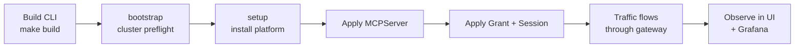

# Getting Started

The shortest path from an empty Kubernetes cluster to a company-ready MCP endpoint: install the manager, registry, broker, and Sentinel stack; deploy one MCP server; grant access; and observe live traffic.

## Prerequisites

- Go `1.25+` (matches the repository `go.mod` files)
- `make`
- Docker or a Docker-compatible client, with the daemon running and reachable
- `kubectl` on `PATH`, configured for the target cluster
- `curl`, `jq`, and `python3` for documented dev and traffic-generation flows
- A Kubernetes cluster (k3s, kind, minikube, Docker Desktop Kubernetes, EKS — see [cluster-readiness.md](cluster-readiness.md) for distribution-specific prep)
- `kind` for local Kind-based clusters

Host bootstrap:

```bash
make deps-install              # best-effort install for supported macOS/Linux hosts
STRICT_DEPS_CHECK=1 make deps-check
```

`make deps-install` is intentionally best-effort: it can install some packages with Homebrew or apt, but it cannot enable Docker Desktop, create cloud credentials, or configure your kubeconfig. Re-run `STRICT_DEPS_CHECK=1 make deps-check` until the required host tools pass.

## 1. Build the CLI

```bash
make deps
make build
```

This produces `./bin/mcp-runtime`.

## 2. Preflight (optional but recommended)

```bash
./bin/mcp-runtime bootstrap
```

Validates: kubectl connectivity, CoreDNS, default `StorageClass`, Traefik `IngressClass`, MetalLB namespace. Warnings only — fix gaps with your platform tooling, or `bootstrap --apply --provider k3s` to install bundled CoreDNS / local-path on k3s.

## 3. Install the platform stack

```bash
./bin/mcp-runtime setup
```

`setup` installs the platform pieces companies need for MCP operations: CRDs, `mcp-runtime` and `mcp-servers` namespaces, the internal Docker registry, ingress wiring, the operator, and the bundled Sentinel stack for gateway policy, analytics, audit, and observability.

Common variants:

```bash
./bin/mcp-runtime setup --with-tls            # cert-manager TLS for the registry
./bin/mcp-runtime setup --without-sentinel    # skip the request-path stack
./bin/mcp-runtime setup --test-mode           # use kind-loaded operator image
```

## 4. Confirm health

```bash
./bin/mcp-runtime status
./bin/mcp-runtime cluster status
./bin/mcp-runtime registry status
./bin/mcp-runtime sentinel status
```

## 5. Connect your first MCP server

### Option A — direct manifest

```yaml
# payments.yaml
apiVersion: mcpruntime.org/v1alpha1
kind: MCPServer
metadata:
  name: payments
  namespace: mcp-servers
spec:
  image: registry.example.com/payments-mcp
  imageTag: v1.0.0
  port: 8088
  publicPathPrefix: payments
  gateway:
    enabled: true
  analytics:
    enabled: true
```

```bash
./bin/mcp-runtime server apply --file payments.yaml
./bin/mcp-runtime server status
```

### Option B — metadata-driven pipeline

Author lightweight metadata YAML, generate CRDs, and deploy:

```bash
./bin/mcp-runtime registry push --image my-server:v1.0.0
./bin/mcp-runtime pipeline generate --dir .mcp --output manifests/
./bin/mcp-runtime pipeline deploy --dir manifests/
```

The server lands at `/{server-name}/mcp` on the configured ingress host, behind the same platform surface you use for future company MCP servers.

## 6. Grant governed access (for gateway-enabled servers)

```yaml
# grant.yaml
apiVersion: mcpruntime.org/v1alpha1
kind: MCPAccessGrant
metadata:
  name: payments-ops-agent
  namespace: mcp-servers
spec:
  serverRef:
    name: payments
  subject:
    humanID: user-123
    agentID: ops-agent
  maxTrust: high
  toolRules:
    - name: list_invoices
      decision: allow
      requiredTrust: low
    - name: refund_invoice
      decision: allow
      requiredTrust: high
```

```bash
./bin/mcp-runtime access grant apply --file grant.yaml
./bin/mcp-runtime access session apply --file session.yaml
./bin/mcp-runtime server policy inspect payments
```

## 7. Observe live traffic and policy

```bash
./bin/mcp-runtime sentinel port-forward ui          # Governance + dashboard
./bin/mcp-runtime sentinel port-forward grafana     # Metrics + traces + logs
./bin/mcp-runtime sentinel logs gateway --follow    # Tail the proxy
```

## End-to-end flow



## Next steps

- [Architecture](architecture.md) — how the pieces fit together.
- [CLI](cli.md) — full command reference.
- [API](api.md) — every CRD field and HTTP endpoint.
- [Sentinel](sentinel.md) — request-path governance, audit, observability.
