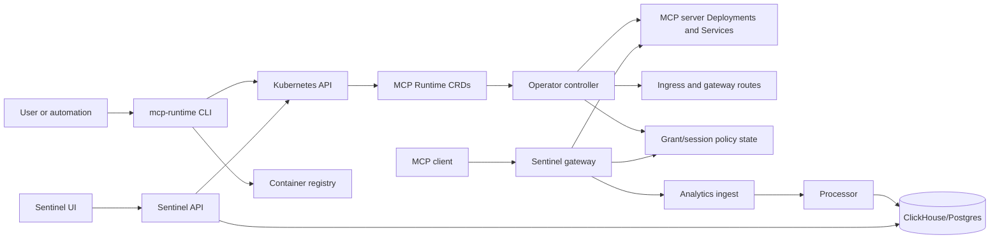
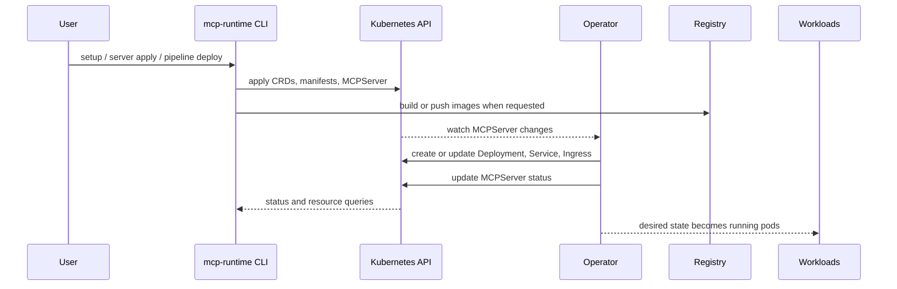
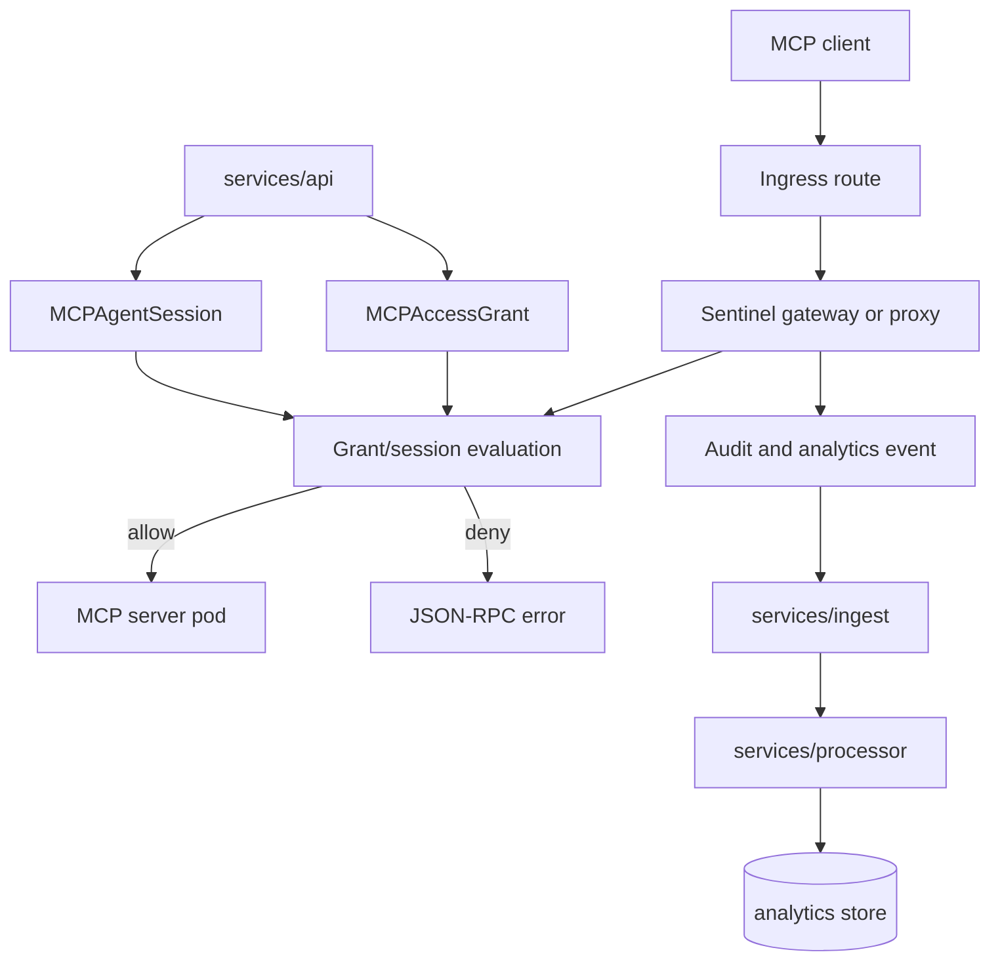
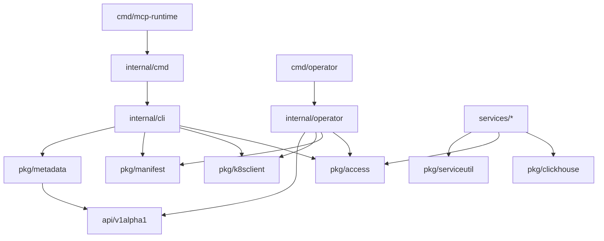

# Internals

This section teaches the MCP Runtime codebase from the inside out. Use it when you want to modify the CLI, operator, Kubernetes API types, Sentinel services, manifests, or tests without reverse-engineering the repository from scratch.

For platform usage, start with the [user docs](../README.md). This section is
for contributors who need to understand package boundaries, runtime flows, and
the checks that protect each subsystem.

## Mental model

MCP Runtime is a Kubernetes-native control plane for MCP servers. Most changes touch one of four surfaces:

1. The CLI turns user intent into Kubernetes manifests, registry actions, cluster checks, and API calls.
2. The CRDs define the durable contract: `MCPServer`, `MCPAccessGrant`, and `MCPAgentSession`.
3. The operator reconciles those CRDs into Deployments, Services, Ingress routes, status, and policy materialization.
4. Sentinel services provide the runtime gateway, governance APIs, analytics ingest, processing, and UI.



## Repository map

| Area | Start here | Why it matters |
|---|---|---|
| CLI entrypoint | [`cmd-mcp-runtime.md`](cmd-mcp-runtime.md) | Shows how the binary starts, wires foldered Cobra commands, and reports errors. |
| CLI implementation | [`internal-cli.md`](internal-cli.md) | Covers the `internal/cmd` routing layer plus setup, bootstrap, registry, server, access, status, sentinel, auth, and pipeline behavior. |
| Kubernetes API types | [`api-types.md`](api-types.md) | Defines the public CRD shapes consumed by users, tests, and the operator. |
| Generated Go reference | [`go-package-reference.md`](go-package-reference.md) | Captures `go doc` output for the main contributor-facing packages. |
| Operator | [`cmd-operator.md`](cmd-operator.md) | Explains manager startup and reconciliation from desired state to Kubernetes resources. |
| Metadata helpers | [`pkg-metadata.md`](pkg-metadata.md) | Covers `.mcp` metadata loading, host resolution, and CRD generation helpers. |
| Manifests and examples | [`config-and-examples.md`](config-and-examples.md) | Explains Kustomize overlays, registry/ingress config, and example MCP servers. |
| Tests | [`tests.md`](tests.md) | Maps unit, golden, integration, and Kind e2e coverage. |

## Control-plane flow

A normal deployment starts in the CLI, passes through the Kubernetes API, and is completed by reconciliation.



When changing this path, check the relevant CLI command, the `api/v1alpha1` contract, the operator reconciliation code, and at least one test that proves the generated or reconciled resource shape.

## Runtime request flow

At request time, clients do not call server pods directly. Traffic flows through the gateway, which checks grants and sessions before forwarding MCP JSON-RPC calls.



Governance-related changes usually span `api/v1alpha1/access_types.go`, `pkg/access/`, `services/api`, `services/mcp-proxy`, `services/ingest`, and the e2e policy scenarios.

## Package dependency guide



Keep shared behavior in `pkg/` only when multiple binaries or services need it. CLI top-level command routing belongs in `internal/cmd`; CLI-only behavior belongs in `internal/cli`; reconciliation behavior belongs in `internal/operator`; HTTP service glue belongs near the service that owns the endpoint.

## Learning path

1. Read [API types](api-types.md) first. The CRDs are the contract that every other subsystem follows.
2. Read [CLI internals](internal-cli.md) and [cmd/mcp-runtime](cmd-mcp-runtime.md) to see how users create, inspect, and deploy resources.
3. Read [operator internals](cmd-operator.md) to understand how `MCPServer` state becomes Kubernetes workloads and ingress.
4. Read [config and examples](config-and-examples.md), then run or inspect the example server manifests.
5. Read [tests](tests.md) before making changes; it shows the fastest feedback loop and the broader CI safety net.
6. Use the change playbooks below to choose the narrowest useful tests before
   broadening to full CI coverage.

## Refreshing Package Reference

These pages are contributor guides. The Go package reference is generated
into [Go Package Reference](go-package-reference.md). Refresh it from the current
checkout with:

```bash
python3 docs/scripts/generate_go_package_reference.py
```

Use the generated output to verify exported types, functions, and comments. Keep
the narrative internals pages focused on stable contracts and contributor
workflows.

## Change playbooks

| Change | Read first | Verify with |
|---|---|---|
| Add or change a CLI flag | `internal/cmd`, `internal/cli`, `cmd/mcp-runtime`, golden CLI tests | `go test ./internal/cmd/... ./internal/cli/... ./test/golden/... -count=1` |
| Change a CRD field | `api/v1alpha1`, CRD YAML, operator reconciliation, docs/API reference | `go test ./api/v1alpha1/... ./internal/operator/... -count=1` |
| Change generated manifests | `pkg/metadata`, `pkg/manifest`, `config/`, examples | targeted package tests plus manifest diff review |
| Change reconciliation behavior | `internal/operator`, API types, k8s helpers | `go test ./internal/operator/... -race -count=1` |
| Change governance policy | `pkg/access`, `services/api`, `services/mcp-proxy`, access CRDs | targeted service tests plus e2e policy scenario |
| Change docs site behavior | `docs/mkdocs.yml`, `docs/nginx.conf`, Markdown pages | MkDocs build or docs container build |

## Contributor checklist

Before opening a change, confirm:

- The code follows the closest existing package pattern.
- Public behavior is reflected in `docs/`, `README.md`, or `AGENTS.md` when relevant.
- CRD changes update both Go types and generated YAML.
- CLI help changes update golden snapshots intentionally.
- Narrow tests pass for touched packages.
- Full `go test ./... -count=1 -race` is run before merge when the change touches shared behavior.
