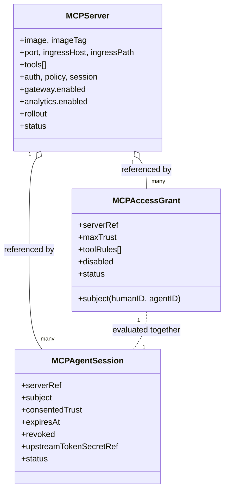
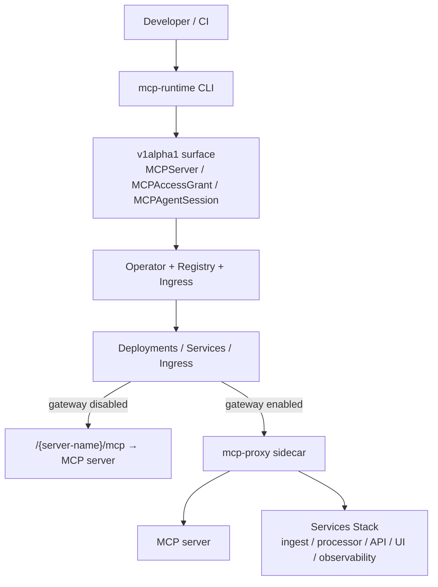
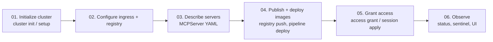

# Runtime

The runtime is the Kubernetes control plane for internal MCP servers. It owns cluster bootstrap, registry and ingress setup, operator reconciliation, deployment resources, rollout, and the access model that sits beside each server before requests reach the [Sentinel](sentinel.md) request path.

> Higher-level than ingress and service mesh. The runtime sits **above** lower-level networking infrastructure and models MCP-specific delivery, access, and rollout concerns. It is not a generic data plane for arbitrary cluster traffic.

## What the runtime owns

| Area | Responsibility |
|---|---|
| **Bootstrap** | `cluster` and `setup` initialize CRDs and namespaces, configure ingress, provision clusters, optionally wire cert-manager TLS. |
| **Server delivery** | The operator reconciles `MCPServer` into Deployments, Services, and Ingress so each server lands at a stable route. |
| **Access and consent** | Grants and sessions are separate resources so policy, trust ceilings, consent, expiry, and revocation stay outside deployment-only YAML. |
| **Gateway-aware rollout** | Servers can stay direct or run behind the proxy sidecar while rollout settings live on the same server resource. |

## Core resources



See the [API reference](api.md) for full field semantics.

## Reconciliation outputs

For every `MCPServer`, the operator reconciles:

- **Deployment** — image, replicas, resource requests/limits, env, image-pull secrets.
- **Service** — ClusterIP exposing `spec.servicePort` → `spec.port`.
- **Ingress** — routes `spec.ingressHost` + `spec.ingressPath` to the Service, with per-class annotations (Traefik / NGINX / Istio).
- **Policy ConfigMap** — rendered from the matching `MCPAccessGrant` + `MCPAgentSession` resources, consumed by the proxy sidecar when `gateway.enabled`.

`MCPServer.status` exposes:

- `phase` — `Pending` → `PartiallyReady` → `Ready`.
- `message` — human-readable progress.
- `conditions` — standard Kubernetes condition slice.
- Per-resource readiness booleans: `deploymentReady`, `serviceReady`, `ingressReady`, `gatewayReady`, `policyReady`.

### Useful defaults

- Servers default to `/{server-name}/mcp`.
- Container port defaults to `8088`, service port to `80`.
- Gateway listens on `8091`.
- `setup` provisions the `mcp-runtime` and `mcp-servers` namespaces.
- Default ingress class is `traefik`; override via `spec.ingressClass`.

## Topology



## Install and delivery flow



| Step | Commands |
|---|---|
| Initialize cluster | `cluster init`, `setup`, `bootstrap` |
| Configure ingress + registry | `cluster config --ingress traefik`, `registry provision` |
| Describe servers | hand-written `MCPServer` YAML or metadata in `.mcp/` |
| Publish + deploy | `server build image`, `registry push`, `pipeline generate / deploy`, `server apply` |
| Grant access | `access grant apply`, `access session apply` |
| Observe | `status`, `sentinel status`, `sentinel port-forward ui` |

## Traffic and enforcement model

| Mode | Behavior |
|---|---|
| **Direct** | No `gateway.enabled`. Service points at the MCP server directly. Server is exposed at `/{server-name}/mcp`. |
| **Gateway** | `spec.gateway.enabled: true`. Traffic flows through the proxy sidecar; identity, policy, audit, and telemetry happen in one place. |
| **Trust evaluation** | Tool `requiredTrust`, grant `maxTrust`, and session `consentedTrust` combine to determine effective trust at tool-call time. |

### Gateway headers

These header names are defaults; override via `spec.auth.{humanIDHeader,agentIDHeader,sessionIDHeader}`.

```text
X-MCP-Human-ID:    user-123
X-MCP-Agent-ID:    ops-agent
X-MCP-Agent-Session: sess-8f1b9d
```

## Operator internals (high-level)

The operator is a single-controller `controller-runtime` manager:

1. Watches `MCPServer` (and owns Deployment / Service / Ingress).
2. On reconcile, fills defaults via `setDefaults`, persists spec changes if defaults were added.
3. Resolves the image string (respecting `imageTag`, `registryOverride`, and `PROVISIONED_REGISTRY_URL`).
4. Builds image-pull secrets, including auto-creating a docker-config secret from provisioned-registry env vars.
5. Reconciles Deployment → Service → Ingress in order.
6. Computes per-resource readiness, sets phase and conditions, writes status.

Source walkthroughs live under [internals/cmd-operator.md](internals/cmd-operator.md).

## Current scope

Implemented and stable enough to evaluate:

- Deployment, routing, image pull, registry handling.
- Grants, sessions, gateway policy generation.
- Trust evaluation and audit-event flow.
- Multi-ingress class support (Traefik, NGINX, Istio, generic).

Not yet:

- Full OAuth 2.1 authorization server flows.
- Multi-cluster federation.

## Next

- [CLI](cli.md) — every command and flag.
- [API](api.md) — full CRD reference with examples.
- [Sentinel](sentinel.md) — what happens after traffic enters the gateway.
