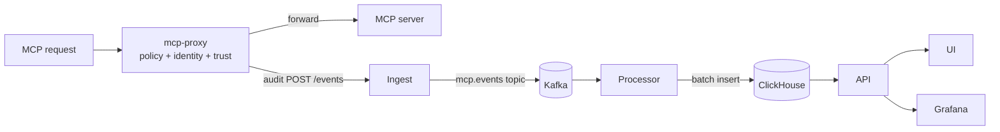

# Sentinel

`mcp-sentinel` is the bundled service stack for proxy enforcement, audit, query, governance UI, and observability around MCP servers. It governs **live MCP requests**, not arbitrary cluster traffic. It ships in `services/` and is installed by default with `mcp-runtime setup` (skip with `--without-sentinel`).

## Services

| Service | Role |
|---|---|
| **mcp-proxy** | Transparent sidecar. Extracts identity, evaluates tool-level policy, emits allow/deny audit events, forwards traffic upstream. |
| **ingest** | Receives `POST /events`, validates API keys or optional JWTs, writes to Kafka. |
| **processor** | Consumes Kafka, batches, writes into ClickHouse with indexed audit fields. |
| **api** | Analytics endpoints, dashboard summaries, runtime governance APIs (grants/sessions), component operations. |
| **ui** | Three-tab dashboard: overview metrics + events, governance forms, operations health + safe restart. |
| **gateway** | Kubernetes deployment fronting the sentinel API, ingest, and UI surfaces. |
| **reference mcp-server** | Small example server in `examples/go-mcp-server` for end-to-end smoke tests. |

## Event path



1. **Proxy evaluates the request.** Reads identity headers, loads policy from the operator-rendered ConfigMap, checks trust, decides allow / deny at `tools/call` time.
2. **Ingest receives the event** on `/events`, writes into Kafka topic `mcp.events`.
3. **Processor batches to ClickHouse.** Reads Kafka, batches, writes to the event table.
4. **API exposes query surfaces.** Recent events, stats, sources, types, filtered audit views.
5. **UI + dashboards consume the data.** UI renders the stream; Grafana / Prometheus / Tempo / Loki / Promtail cover the broader observability path.

## Storage and observability

| Component | Role |
|---|---|
| **ClickHouse** | Stores the event stream with materialized fields: server, namespace, cluster, human, agent, session, decision, tool name. |
| **Kafka + Zookeeper** | Buffer between ingest and processor. |
| **Prometheus + Grafana** | Service metrics, scrape config, dashboards. |
| **OTel Collector + Tempo** | Distributed tracing pipeline. |
| **Loki + Promtail** | Log shipping and storage. |

## Auth and APIs

`api` and `ingest` support both API keys and optional OIDC JWT validation (issuer, audience, JWKS).

```text
POST /events
GET  /api/events?limit=100
GET  /api/stats
GET  /api/sources
GET  /api/event-types
GET  /api/events/filter?server=payments&decision=deny&agent_id=ops-agent&limit=50
GET  /health
GET  /metrics
```

Full HTTP surface is in the [API reference](api.md).

## Governance UI walkthrough

The UI's **Governance** tab creates and operates the same `MCPAccessGrant` and `MCPAgentSession` resources the CLI manages. The same flows are available via the Runtime Governance API ([API → Runtime Governance](api.md#runtime-governance-api)).

| Action | What it does |
|---|---|
| **Create grant** | `Create Grant` button. Required: name, namespace, server, and at least one of human or agent ID. Tool rules use one rule per line: `tool:allow` or `tool:allow:trust`. |
| **Create session** | `Create Session`. Pick a consented trust level and optional expiry. The gateway looks it up at `tools/call` time alongside the grant. |
| **Disable / enable grant** | Single-action row. Disable flips `spec.disabled=true` — grant is preserved for audit, but the gateway treats it as denying. |
| **Revoke / unrevoke session** | Same row pattern toggles `spec.revoked`. Revoked sessions deny subsequent tool calls immediately. |
| **Filter** | Search box on each table filters by server, human ID, agent ID. Local to the loaded set — refresh first if cluster state has changed. |

Tool-rule example:

```text
list_invoices:allow
refund_invoice:allow:high
```

CLI parity: `mcp-runtime access grant` and `mcp-runtime access session` cover the same CRUD flows. CRs are the source of truth — the UI is a convenience layer.

## Manifests

| Group | Files |
|---|---|
| **Core app** | `00-namespace`, `01-config`, `02-secrets`, `03-clickhouse`, `04-clickhouse-init`, `05-kafka`, `06-ingest`, `07-processor`, `08-api`, `09-ui`, `10-gateway` |
| **Observability** | `11-prometheus`, `12-grafana`, `15-otel-collector`, `16-tempo`, `17-loki`, `18-promtail`, `19-grafana-datasources` |
| **Example wiring** | `13-mcp-example`, `14-mcp-proxy-sidecar` |

`mcp-runtime setup` builds the sentinel images and deploys this stack by default. Use `--without-sentinel` to skip.

## Operating the stack

```bash
# Health + Kubernetes events
mcp-runtime sentinel status
mcp-runtime sentinel events

# Logs
mcp-runtime sentinel logs ingest --since 15m --follow
mcp-runtime sentinel logs grafana --tail 500

# Local UI / API access
mcp-runtime sentinel port-forward ui
mcp-runtime sentinel port-forward grafana

# Restart
mcp-runtime sentinel restart gateway
mcp-runtime sentinel restart --all
```

`sentinel events` is a Kubernetes event view for the `mcp-sentinel` namespace.
Use `/api/events` or `/api/events/filter` when you need the request/audit
events emitted by `mcp-proxy`.

See [CLI → sentinel](cli.md#sentinel) for component keys and flag details.

## Repository structure note

Services live in `services/`, manifests in `k8s/`, shared libraries in `pkg/` (replacing the older nested `mcp-sentinel/` directory). New `pkg/access`, `pkg/sentinel`, `pkg/clickhouse`, and `pkg/k8sclient` packages are used by both CLI and API services. The runtime and example MCP wiring still accept older `MCP_ANALYTICS_*` env names so existing ingest configuration keeps working during the rename.

## Next

- [API → Runtime Governance API](api.md#runtime-governance-api) — the HTTP surface the UI uses.
- [Architecture](architecture.md) — how the proxy fits into the broader request path.
